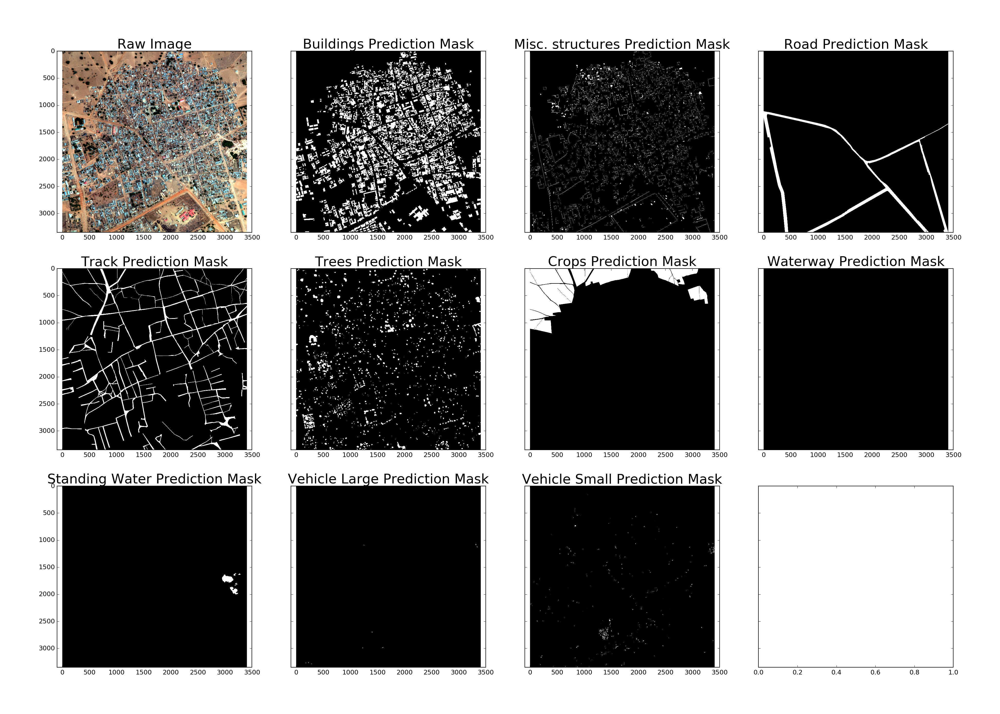

# Dstl-Satellite-Imagery-Feature-Detection
Place 18 solution for the [Dstl feature detection kaggle challenge](https://www.kaggle.com/c/dstl-satellite-imagery-feature-detection) from [DeepVoltaire](https://www.kaggle.com/voltaire) and [Hao](https://www.kaggle.com/lihaorocky)

The goal was to find ten potentially overlapping features (buildings, other structures, roads, tracks, trees,
crops, rivers, lakes, trucks, cars) in satellite images. This solution uses the [U-Net](https://arxiv.org/abs/1505.04597) neural network
architecture to segment the images for ten binary classes.

## Example input image

## Example output feature detection

## To reconstruct the solution
- Put all data from Kaggle into data/
- run Preprocessing.py, then training.py and finally submission.py for a good solution from one single model
- to improve, run the same U-Net model for several classes individually (change the output to only include one class).
I used additional single models for buildings, structures, tracks and trees, the other predictions performed better from the
10 class model.

#### Thanks to visoft, n01z3, Sergey Mushinskiy, Konstantin Lopuhin for the great scripts and discussions.
